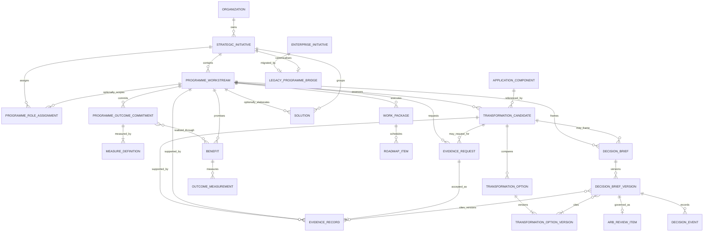
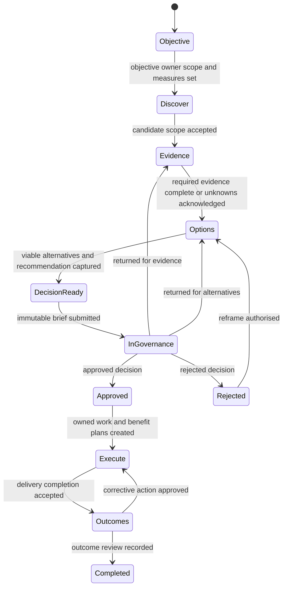

# Application Rationalisation Transformation Room

**Status:** Approved architecture, implementation specification  
**Date:** 2026-08-22  
**Decision:** `StrategicInitiative` becomes Archie's canonical, reusable, business-first Transformation Programme aggregate. Application Rationalisation is its first complete workstream. A `Solution` is optional and is created only when an approved option genuinely requires technology architecture.

## 1. Outcome and design principles

Archie must help an organisation move from a business objective to a measured transformation outcome without pretending that every change is a technology solution. The Transformation Room is the shared workspace for that loop:

```text
Objective -> Discover -> Evidence -> Options -> Decision / Govern -> Execute -> Outcomes
```

It is an orchestration experience over canonical architecture and delivery records, not a new parallel EA repository. It must:

- preserve the business reason, accountable people, evidence, decisions, delivery work and realised outcomes as one traceable chain;
- use persisted tenant data as facts and label derived, asserted, estimated, stale and unknown values honestly;
- let process, organisation/skills, policy/control, data, supplier and technology workstreams coexist under one programme;
- create a `Solution` only after a decision selects a technology-architecture option;
- use canonical ARB, `WorkPackage`, `RoadmapItem` and `Benefit` records rather than rationalisation-specific imitations;
- make every state change authorised, atomic, idempotent and auditable; and
- preserve current deep links while progressively retiring duplicate programme meanings and rationalisation pseudo-workflows.

## 2. Personas, jobs and success measures

| Persona | Job in the room | Required outcome |
|---|---|---|
| Chief Architect | See transformation posture, evidence quality, cross-domain impact, decision debt and conformance | Can identify the decisions needing intervention and inspect their evidence and downstream execution |
| Enterprise Architect | Frame objectives, map capabilities/value streams, compare options and maintain enterprise traceability | Can produce a defensible, cross-domain recommendation without manufacturing a Solution |
| Application / Portfolio Architect | Discover candidates, validate TIME assessments, dependencies, owners, costs and risks | Can move a candidate from signal to governed disposition with complete provenance |
| Solution Architect | Elaborate only the approved technology change | Receives a linked Solution with programme context, decision constraints and evidence intact |
| Business / Capability Owner | Attest facts, weigh business impact and own benefits | Can respond through a focused inbox and see what was decided from their evidence |
| Programme / Delivery Lead | Convert approved decisions into accountable work and milestones | Can track packages, roadmap dependencies, risks and outcome commitments in the same programme |
| ARB member / Decision authority | Review a stable decision brief and record a governed decision | Sees immutable submitted evidence, conflicts, unknowns and execution implications |
| Data contributor | Correct or attest a small set of assigned facts | Does not need to navigate the whole EA meta-model |

Product measures are persisted events and durations, segmented by organisation and workstream type:

- median time from programme intake to first decision-ready brief;
- median time spent in each lifecycle stage and ageing beyond its service target;
- candidate coverage: discovered, owner-attested, evidence-complete and decided;
- recommendation acceptance, rejection, return-for-evidence and architect-override rates;
- unknown/stale evidence rate at submission and its trend;
- time from approved decision to owned work package and scheduled roadmap item;
- benefit plans with owner, baseline, target and measurement method;
- realised versus expected benefit, including explicitly not-realised outcomes;
- optional-Solution ratio by workstream type (a guard against technology-by-default);
- AI draft acceptance, correction, abstention quality, cost and time saved per completed decision; and
- transition failures, idempotent replays and authorisation denials.

No missing measure is rendered as zero. It is `null` and displayed as an em dash with the reason it is unavailable.

Existing `StrategicInitiative.budget_remaining`, `budget_utilization_percentage` and `completion_percentage` coerce absent facts to zero and therefore are not reused for Transformation Room truth. New nullable projection functions require provenance and return `None` when allocation, spend, milestone or measurement evidence is absent. Monetary aggregation is only within one ISO currency unless an explicit dated exchange-rate source is cited.

## 3. Scope and non-goals

### In scope

- A reusable Transformation Programme home and lifecycle based on `StrategicInitiative`.
- Typed programme workstreams and role assignments.
- Application Rationalisation from objective through measured outcome.
- Persisted candidate scope, versioned evidence, option comparisons and immutable submitted decision briefs.
- Governance of programme/workstream decisions without requiring a `Solution`.
- Optional creation and linking of a `Solution` after approval.
- Canonical execution through `WorkPackage`, `RoadmapItem` and `Benefit`.
- Compatibility and migration for existing programme, portfolio and rationalisation data and URLs.
- Evidence-backed AI assistance that drafts but cannot silently approve or alter architecture truth.

### Non-goals

- Replacing all programme-management, portfolio, vendor, motivation or ArchiMate models in one release.
- Turning the room into a generic project-management suite or rebuilding resource/time-sheet tooling.
- Creating a third application inventory, capability model, ARB implementation, benefit tracker or roadmap.
- Automatically accepting AI recommendations, owner attestations or governance decisions.
- Forcing non-technology transformations through solution-design forms.
- Migrating `EnterpriseInitiative` consumers with an indefinite dual-write compatibility layer.
- Deleting historic rationalisation records during initial rollout.

## 4. Canonical information architecture

### 4.1 Aggregate ownership

`StrategicInitiative` is the aggregate root and is presented as **Transformation Programme** when `record_kind = "transformation_programme"`. Existing strategic initiatives remain valid and are not silently reclassified; only existing programme records identified by current programme semantics (`initiative_type` populated or referenced as a programme by a Solution) and newly created programmes receive that kind.

New entities:

| Entity | Purpose and ownership |
|---|---|
| `ProgrammeWorkstream` | Tenant-scoped child of one Transformation Programme. Owns type, objective, lifecycle, lead and scope boundary. Types: `application_rationalisation`, `process`, `organisation_skills`, `policy_control`, `data`, `supplier`, `technology`, `other`. |
| `ProgrammeRoleAssignment` | Effective-dated assignment of a user to a programme/workstream role; programme owner remains the root owner, while contributor, evidence owner, decision authority and delivery lead are explicit assignments. |
| `ProgrammeOutcomeCommitment` | Tenant-scoped promise owned by a programme or workstream: outcome statement, accountable owner, direction of improvement, target date and lifecycle. It links to one or more `MeasureDefinition` rows and, once execution is approved, to one or more canonical `Benefit` rows. Intake therefore persists outcomes before Benefits exist; execution does not invent them later. |
| `MeasureDefinition` | The measurement contract for an outcome: metric name, unit, aggregation, baseline/target values and dates, cadence, source adapter/key, tolerance and explicit unavailable reason. Financial values use `Numeric(18,2)` plus ISO-4217 currency; percentages/quantities use `Numeric(24,6)`. It never uses binary float. |
| `TransformationCandidate` | A workstream-scoped item being assessed. It references a canonical subject (`ApplicationComponent` first) and never copies the subject as a new inventory record. A uniqueness constraint covers `(organization_id, workstream_id, subject_type, subject_id)`. |
| `EvidenceRecord` | Append-only, versioned observation or attestation linked to a candidate or workstream. Stores field/claim, typed value, source, collector, observed time, freshness rule, confidence, status and supersession. |
| `EvidenceRequest` | Persisted request for a named claim and subject, assigned contributor, due date, required/non-blocking classification and status (`open`, `submitted`, `accepted`, `declined`, `expired`, `cancelled`). A submitted response creates Evidence, but the request is completed only when an authorised architect accepts that version. |
| `TransformationOption` | A persisted option for one candidate or workstream, including action type, description, assumptions, dependencies, expected impacts, cost/risk ranges and optional technology requirement. Options are editable drafts until captured in a decision-brief version. |
| `TransformationOptionVersion` | Immutable option snapshot. Every comparison and brief cites exact version IDs; fields include typed monetary ranges/currency, benefit/risk ranges, assumptions, dependencies, impact and technology requirement. A canonical hash covers content, tenant, logical option ID, version and capture metadata. |
| `DecisionBrief` | Stable logical decision case for a candidate or workstream. Owns recommendation and governance subject identity. |
| `DecisionBriefVersion` | Immutable submitted snapshot of objective, scope, alternatives, recommendation, evidence citations, unknowns, conflicts, impacts and assertions. A content hash detects mutation. Drafting produces a new version; submitted versions are never updated or deleted. |
| `DecisionEvent` | Append-only state/decision history for a brief and its ARB review: event type, from/to state, actor, rationale, conditions, source review ID and time. Current status is a projection; this log is the audit truth. |
| `OutcomeMeasurement` | Append-only observation against a canonical `Benefit`, with source, measurement time, value and recorder. The current `Benefit.actual_*` projection may be refreshed transactionally for compatibility. |
| `CommandIdempotencyRecord` | Mutable only while a command is `in_progress`; stores tenant, actor, operation, key, request digest, lease and final response IDs/error class. Terminal `succeeded`/`failed_non_retryable` rows are immutable. Expired in-progress leases may be taken over atomically. |
| `DeliveryExportAttempt` | Append-only attempt/result for sending a canonical WorkPackage to an external delivery system. Retry is a new attempt linked by predecessor ID; external keys never overwrite history. |
| `LegacyProgrammeBridge` | Temporary one-to-one mapping from an `EnterpriseInitiative` to its canonical `StrategicInitiative`, with migration state and source fingerprint. It prevents duplicate imports and makes retirement measurable. |

Canonical existing entities remain authoritative:

- `ApplicationComponent` owns application identity, lifecycle and inventory facts.
- `UnifiedCapability` is the target capability authority because current Benefits,
  WorkPackages and application mappings already consume it. It must gain
  `organization_id` plus mechanical tenant scoping before the Transformation Room
  may reference it. `BusinessCapability` and ArchiMate `Capability` remain
  compatibility/source layers joined through an explicit, tenant-validated
  crosswalk; name-only matching is prohibited. `ValueStream`, `ValueStreamStage`
  and motivation elements retain their existing canonical responsibilities.
- `Solution` owns technology architecture only; its existing `initiative_id` links it to the programme and a new nullable `workstream_id` identifies the originating workstream.
- `ARBReviewItem` is the single governance review record. It gains additive
  `subject_type`, `subject_id` and nullable `decision_brief_version_id` fields.
  Existing `solution_id`, `architecture_model_id` and `adr_id` fields remain
  compatibility projections during migration. A constraint/service invariant
  requires exactly one governed subject, and the typed subject adapter verifies
  that the subject belongs to the same organisation.
- `WorkPackage` is the execution unit, `RoadmapItem` is the time/dependency projection, and `Benefit` is the measurable promised outcome.

### 4.2 Relationship model



Relationship ownership rules:

1. The programme owns workstreams; deleting a programme is prohibited while it has workstreams, reviews, work, benefits or Solutions. Archive is the normal terminal action.
2. A candidate owns neither an application nor copied application facts. It owns assessment context and cites evidence versions.
3. A decision brief owns its versions; the ARB item owns governance status and decision. Rationalisation records must not own an alternative `arb_status` after migration.
4. A workstream owns delivery linkage, not duplicate work. `WorkPackage`,
   `RoadmapItem`, `Benefit` and optional `Solution` remain independently canonical
   and carry explicit workstream/programme foreign keys. `RoadmapItem` must gain
   `organization_id` and `TenantMixin` before it is adopted by this flow; legacy
   rows are backfilled and verified first.
5. A Solution may belong to one programme and one workstream within that programme. A service invariant rejects mismatched parents.
6. Every tenant-scoped child carries `organization_id`; foreign-key identity alone is never accepted as proof of same-tenant membership.
7. Evidence supersession is a single ordered chain per `(tenant, subject, claim_key, source_identity)`: exactly one unsuperseded leaf is enforced by a partial unique index. Concurrent corrections lock that leaf; attempts to create forks return `409`. Different sources may have independent leaves and surface as an explicit conflict rather than silently superseding one another.

## 5. Lifecycle and gates

Programme lifecycle: `draft -> active -> outcomes_monitoring -> completed`, with `on_hold`, `cancelled` and `archived` controlled transitions. A programme can complete only when all non-cancelled workstreams are terminal and unresolved outcome gaps are acknowledged.

Workstream lifecycle is the user-visible journey:



Gate requirements:

| Gate | Required persisted evidence |
|---|---|
| Objective -> Discover | named programme and workstream owner; business objective; at least one `ProgrammeOutcomeCommitment` with accountable owner and at least one valid `MeasureDefinition`; scope expression; target date or explicit unknown reason |
| Discover -> Evidence | candidate inclusion decision; subject exists in tenant; duplicates resolved; candidate owner assigned or missing-owner task created |
| Evidence -> Options | every required `EvidenceRequest` is accepted, declined/unavailable with an authorised acknowledgement, or expired and explicitly waived; application owner attestation or explicit unavailable/declined state; lifecycle, cost, business criticality, capability impact, dependency impact, risk and source/freshness evaluated; conflicts and unknowns visible |
| Options -> Decision-ready | at least two genuinely distinct immutable `TransformationOptionVersion` records unless a policy exception is reasoned; assumptions; benefits; costs/ranges and ISO currency; risks; dependencies; reversibility; affected capabilities/value streams; recommendation rationale; technology-required flag |
| Decision-ready -> Governance | authorised submitter; immutable brief version; cited evidence versions; explicit human review of AI-authored material; named decision authority; all blockers cleared; acknowledged non-blocking unknowns |
| Governance -> Approved/Rejected | canonical ARB decision with decision maker, rationale, conditions and timestamp; no client-authored status |
| Approved -> Execute | each approved action is accepted, declined with reason, or linked to an owned WorkPackage; each outcome commitment is linked to a canonical Benefit whose measurement definition supplies owner, baseline/unknown reason, target and method; RoadmapItem exists when scheduling is applicable; every open `ARBCondition` is satisfied with accepted evidence or has an authorised, reasoned, expiring waiver |
| Execute -> Outcomes | delivery completion evidence, residual risk, operational owner and measurement schedule |
| Outcomes -> Completed | actual measurement or explicit not-measurable record; realised/not-realised judgement; lessons and follow-up decision; no fabricated zero |

Gate evaluation is a pure, versioned policy result produced by the domain service. Routes and templates render it but cannot invent readiness. Policy changes apply prospectively; historic submitted briefs retain the policy version used.

## 6. Application Rationalisation end-to-end

### Objective

An Enterprise Architect creates a Transformation Programme at `/solutions/new-programme`, selects a business objective (for example reduce run cost, reduce operational risk, simplify a merger estate or improve capability performance), then adds an Application Rationalisation workstream. Programme creation persists only the programme, ownership, initial measure and workstream in one transaction. It does **not** create a Solution.

### Discover

The workstream proposes candidate applications from canonical inventory using explicit, inspectable rules: duplicate capability coverage, cost, end-of-life exposure, risk, technical health, dependency concentration and owner/data gaps. Each signal contains query/rule version, source record IDs and evaluation time. An architect accepts candidates into scope; acceptance creates `TransformationCandidate`, not a duplicate app. AI may explain or rank candidates but must cite these signals, state confidence and abstain when the required facts are missing.

### Evidence

The room shows one evidence ledger per candidate: business owner, capability/value-stream contribution, users, cost and cost provenance, lifecycle/support dates, integrations/dependencies, risk, compliance, technical/business fit and freshness. Contributors receive precise attestation requests. Corrections update canonical source entities through their governed services; the assessment records a new `EvidenceRecord` version referencing the resulting source version. Superseded evidence remains readable.

Unknown, stale, conflicting, inferred and asserted data are visually and structurally distinct. A derived score carries its formula/policy version and input evidence IDs. The TIME recommendation is a recommendation, never an application lifecycle mutation.

### Options

The architect compares Tolerate, Invest, Migrate, Eliminate and a context-specific alternative where relevant. Each option records scope, assumptions, cost/range and currency, benefit/range, risk, capability/customer impact, dependencies, transition approach, reversibility and technology-architecture need. The server derives comparison summaries from persisted records; it does not trust client-authored option totals. A single option is allowed only with a named policy/legal constraint and explicit exception.

### Decision / Govern

`DecisionBriefService.freeze()` resolves and snapshots the programme objective, outcome commitments/measure definitions, candidate subject, exact immutable option versions, recommendation, cited evidence versions, conflicts, unknowns, human assertions and expected execution/outcomes. The result is immutable. The existing `ARBSubmissionService` is generalised—not replaced—as the sole writer for every ARB submission. Its existing Solution subject adapter, evidence evaluation and `ARBSubmissionEvidenceSnapshot` remain intact. A new Decision Brief subject adapter supplies the same service contract and creates exactly one canonical `ARBReviewItem` and subject-specific immutable snapshot.

This is the canonical non-Solution ARB subject strategy: ARB reviews a `DecisionBriefVersion`, not an invented Solution. The ARB review UI resolves a typed subject adapter that supplies title, evidence dossier, risk, decision actions and canonical deep link. Existing Solution ARB submissions continue to use the evidence-gated Solution adapter. A generic ARB endpoint must delegate to the typed service or reject an unsupported subject; it cannot create a second rationalisation review state.

The decision authority approves, rejects, returns for evidence/options, or approves with conditions. That action and rationale live on the canonical ARB item and append-only decision event. The workstream projects the result; it does not duplicate it.

`ARBReviewItem` receives additive nullable `subject_type`, `subject_id`, `decision_brief_version_id` and `review_cycle_id` fields. Existing `solution_id` remains the Solution adapter's compatibility FK; service invariants require exactly one supported subject and reject disagreement between it and typed fields. `ARBReviewCycle` has tenant, subject type/ID, integer `cycle_number`, predecessor cycle, opened/closed times and terminal outcome. Uniqueness is `(organization_id, subject_type, subject_id, cycle_number)`; only one open cycle per subject is enforced by a partial unique index. Resubmission after `returned`, `rejected` or materially changed approved conditions opens the next locked counter. A retry in the same cycle returns the existing review/snapshot. Review numbers become tenant/year/sequenced identities backed by a database counter rather than the current race-prone global last-row scan.

Legacy Solution reviews are backfilled with `subject_type = "solution"`, `subject_id = solution_id`, cycle numbers ordered by submitted/created time and stable ID, and a corresponding cycle. Reviews lacking a supported subject are retained as `legacy_generic` read-only and cannot be submitted through the new service. Existing evidence snapshots attach to the backfilled cycle; nothing is regenerated or represented as newly reviewed. Decision Brief reviews use `subject_type = "decision_brief_version"` and the exact immutable version ID.

`approved_with_conditions` is a real decision, not equivalent to unconditional execution. Existing canonical `ARBCondition` rows are reused and linked to Evidence Requests/accepted Evidence where applicable. Materialisation is blocked while any mandatory condition is open. The decision authority may grant a reasoned, expiring waiver with scope, approver and compensating control; waiver is a Decision Event and never deletes the condition. Fulfilment/waiver changes append events, and execution records the condition set and evidence state it relied on.

### Execute

For each approved option, `TransformationExecutionService.materialise()` atomically and idempotently:

- creates or links canonical `WorkPackage` records with owner, dates, dependencies, acceptance evidence and the decision-version ID;
- creates/links `RoadmapItem` records for scheduling and cross-programme dependency views;
- creates/links `Benefit` records with owner, baseline, target, unit, method and frequency; and
- creates a `Solution` only when `technology_architecture_required = true` and an authorised architect explicitly selects **Create technology solution**. The Solution inherits links and constraints from the approved decision, but does not become the programme or replace the decision brief.

The materialisation key is `(decision_brief_version_id, action_kind, approved_option_id)`; retries return existing IDs. Partial creation rolls back. If a delivery tool integration is unavailable, the canonical Archie work package remains pending export with an honest failure record.

The exact additive canonical links are:

- `app.models.implementation_migration.WorkPackage`: nullable `strategic_initiative_id -> strategic_initiatives.id ON DELETE RESTRICT`, `programme_workstream_id -> programme_workstreams.id ON DELETE RESTRICT`, `decision_brief_version_id -> decision_brief_versions.id ON DELETE RESTRICT`, `materialisation_key` and `organization_id` (already present through `TenantMixin`). Existing `enterprise_initiative_id ON DELETE SET NULL` remains migration provenance only. The canonical fields take read precedence after mapping; disagreement is a migration conflict, never fallback.
- `app.models.strategic.RoadmapItem`: add `organization_id -> organizations.id ON DELETE RESTRICT`, `programme_workstream_id -> programme_workstreams.id ON DELETE RESTRICT`, `work_package_id -> work_packages.id ON DELETE RESTRICT`, `decision_brief_version_id -> decision_brief_versions.id ON DELETE RESTRICT` and `materialisation_key`. Existing `initiative_id` remains the canonical programme FK and must equal the workstream's programme.
- `app.models.benefit.Benefit`: add nullable `strategic_initiative_id -> strategic_initiatives.id ON DELETE RESTRICT`, `programme_workstream_id -> programme_workstreams.id ON DELETE RESTRICT`, `outcome_commitment_id -> programme_outcome_commitments.id ON DELETE RESTRICT`, `decision_brief_version_id -> decision_brief_versions.id ON DELETE RESTRICT` and `materialisation_key`. Existing `initiative_id -> enterprise_initiatives.id ON DELETE CASCADE` is renamed logically as `legacy_enterprise_initiative_id`; the migration first drops its `CASCADE` FK and recreates it `ON DELETE SET NULL` before any bridge retirement, preventing deletion of canonical benefits.

Each table has a partial unique constraint on `(organization_id, materialisation_key)` when the key is non-null. For migrated rows, canonical FKs are populated only from proven bridge/source identity and the materialisation key is a deterministic migration namespace. During compatibility, reads prefer canonical FKs; the legacy FK is consulted only when canonical is null and the bridge is verified. Writes never populate the legacy FK. Programme/workstream deletion is `RESTRICT`; archive retains execution history.

External export mutability is separated from canonical delivery truth. `WorkPackage` export state is a derived projection only; every network call creates a `DeliveryExportAttempt`. Attempt request, response digest, external key, status and error are append-only after completion. A retry never overwrites a failed attempt.

### Outcomes

Delivery completion begins outcome monitoring; it does not assert benefit realisation. Measurements append to `OutcomeMeasurement`, cite a source and update the compatible `Benefit.actual_value/actual_date` projection in the same transaction. Archie presents expected, actual and variance only when comparable units/baselines exist. Missed outcomes remain as `not_realised`, trigger an owner review and may create a corrective option; they are never deleted or coerced to zero.

## 7. Evidence, provenance and immutability

Every `EvidenceRecord` includes:

- tenant, programme/workstream and candidate scope;
- stable claim key and typed value plus unit/currency;
- classification: `observed`, `attested`, `derived`, `estimated`, `external_reference`, `unknown`, `conflict`;
- canonical source type/ID/version or external URI/document checksum;
- source system, collected/observed/valid-from times and freshness rule;
- author/collector and, for AI, provider/model/run identifiers and cited input IDs;
- confidence only when meaningful, with method;
- supersedes ID and immutable creation metadata.

Changes append a new row whose `supersedes_id` points to the former row; the former
row is never marked or changed. The active-evidence view selects the newest valid
leaf in each supersession chain and reports forks as conflicts. PostgreSQL triggers
reject `UPDATE` and `DELETE` of evidence records, decision-brief versions,
brief-to-evidence citations, outcome measurements and decision events. Trigger
installation is idempotent in schema reconciliation and covered against direct
SQL, comments, CTEs and schema-qualified statements. Administrative correction is
a compensating record, never mutation.

A decision hash covers canonical serialisation of the version, captured option versions, evidence citations, policy version, subject identity, tenant, creator and capture time. Reading verifies the hash. Submission fails closed if a citation is absent, cross-tenant, superseded without acknowledgement, or changes between evaluation and commit.

### 7.1 Evidence source adapters and conflicts

An `EvidenceSourceAdapter` has `resolve(source_key, actor_context)`, `read_version()`, `canonical_uri()`, `freshness()` and `authorise_correction()` methods. A versioned source supplies its native immutable revision and checksum. An unversioned source is read in one transaction and assigned a snapshot checksum over canonical field/value/source/timestamp data; subsequent reads create new Evidence versions rather than altering that snapshot. External documents are content-addressed by checksum and retain retrieval metadata.

An attestation is an actor's assertion about a source fact, not authority to rewrite it. If the attestation agrees, it becomes a separate accepted evidence source linked to the observed fact. If it disagrees, both leaves remain and a `conflict` Evidence record cites them; gates block until an authorised correction changes the canonical source through its owner service or a decision authority records which source governs this decision and why. A correction therefore produces a new canonical-source revision plus a new observed Evidence version. It is never represented by editing an attestation or silently choosing its value.

### 7.2 UnifiedCapability tenancy cutover

`UnifiedCapability` is currently shared and globally unique (`code`, `archimate_id`) while Transformation Programme data is tenant-scoped. Release 1 does not pretend ORM tenant filtering already protects capabilities. The target is explicit hybrid ownership:

- reference-library capabilities have `scope = "reference"`, `organization_id = NULL`, are read-only to tenants and may keep a global `reference_code` identity;
- organisation capabilities have `scope = "tenant"`, non-null `organization_id`, and all mutable assessment/ownership fields are tenant-owned;
- programme/candidate links may reference either, but tenant-specific observations about a reference capability live in tenant-scoped mappings/evidence, never on the shared row.

This requires an explicit maintenance migration, not additive reconciliation alone. It adds nullable `organization_id`, `scope`, `reference_capability_id` and provenance (`source_table`, `source_id`, `source_org_id`, `source_checksum`) fields; backfills existing seeded/catalogue rows as reference and classifies tenant-authored rows from auditable relationship provenance. Ambiguous rows are blocked for manual classification. It then replaces global unique constraints on `code` and `archimate_id` with partial uniqueness: reference values unique where `organization_id IS NULL`; tenant values unique on `(organization_id, code)` and `(organization_id, archimate_id)` where non-null. Foreign keys are preserved, indexes are built concurrently where PostgreSQL permits, duplicate conflicts are resolved via recorded repoint-then-retire mappings, and before/after references are measured.

Cutover runs in a maintenance window because dropping the existing unique constraints cannot be performed by the add-only reconciler. Deployment first ships code able to read old and new layouts, takes a backup, runs the classified backfill and constraint swap, verifies zero ambiguous active links and per-tenant isolation, then enables tenant capability writes. Rollback before the constraint swap restores the backup; after it, the compatible release reads the new shape and a reverse migration is used only if referential verification fails. No tenant-scoped Transformation Room capability mutation is enabled until this cutover is green.

## 8. Tenant isolation, identity and authorisation

All new aggregate children inherit `TenantMixin`; shared/reference records are explicitly classified. Service methods require an `ActorContext` containing authenticated user and active organisation. They load every supplied ID under explicit organisation predicates, even though ORM request filtering remains enabled. Background jobs and multi-tenant loops establish one tenant/session at a time and clear the identity map between tenants.

Authorisation policy:

- programme/workstream read: organisation member with relevant portfolio access;
- create/edit objective and candidate scope: programme owner, Enterprise/Chief Architect or delegated workstream lead;
- attest evidence: assigned owner/contributor for that claim, or architect with reasoned override;
- draft options/brief: architect roles or delegated workstream lead;
- submit: named governance submitter with all gates passing;
- decide: ARB member/decision authority, never the submitter acting through client-provided identity;
- materialise execution or Solution: programme/delivery lead or authorised architect after approval;
- record outcomes: benefit owner or delegated measurer; and
- archive: programme owner/administrator when retention invariants permit.

Payload fields such as `organization_id`, `created_by_id`, `decision_by_id`, readiness, review status and lifecycle status are ignored or rejected. The server derives identity and state. Cross-tenant IDs return not-found semantics without disclosing existence. CSRF applies to browser mutations; APIs use the established authenticated mechanism and equivalent replay protection.

For HTTP, unauthenticated is `401`, an authenticated actor lacking a general action is `403`, and any identifier outside the active tenant (including a globally existing ID) is `404`. Each denial emits a security audit event containing tenant/actor/request correlation and opaque reason code but never the foreign record's tenant or title. Repeated probes are rate-limited and alerted.

## 9. Service and API boundaries

Routes remain thin. Domain services own validation, authorisation, transitions and transactions:

- `TransformationProgrammeService`: create/read/update/archive programme; add workstreams and roles; programme roll-up.
- `TransformationGateService`: evidence-based lifecycle evaluation with stable blocker codes and policy version.
- `RationalisationDiscoveryService`: deterministic signals and candidate acceptance.
- `TransformationEvidenceService`: attest, derive, supersede and retrieve evidence.
- `TransformationOptionService`: option drafts, comparisons and server-derived ranges.
- `DecisionBriefService`: evaluate/freeze/version/read and content-hash verification.
- existing canonical governance service extended with typed subject adapters for Solution and Decision Brief.
- `TransformationExecutionService`: materialise approved work, roadmap, benefits and optional Solution.
- `OutcomeMeasurementService`: append measurements and calculate comparable variances.
- `LegacyTransformationMigrationService`: profile, map, migrate, verify and retire legacy reads.

Versioned JSON endpoints sit below `/api/v1/transformation-programmes` and return a consistent envelope with `data`, `meta`, `errors` and `request_id`. Primary resources are programmes, workstreams, candidates, evidence, options, briefs, transitions, execution and outcomes. Mutation endpoints require `Idempotency-Key`; the server persists key, actor, organisation, operation, request digest, result and expiry. Reuse with a different digest is `409`.

Concurrency uses a row lock on the workstream/brief for transition and submission, database uniqueness for natural idempotency keys, and one transaction per command. Expected version (`If-Match`/revision) rejects stale edits with `409`. No route commits inside subordinate services.

`CommandIdempotencyRecord` is written in a short claim transaction before domain work and finalised after the domain transaction with its canonical result IDs. Its key is unique on `(organization_id, actor_id, operation, idempotency_key)`. A same-digest completed replay returns the stored outcome; a different digest is `409`; an active lease is `409` plus retry guidance; an expired lease is atomically acquired. Payload digest, identity and terminal result are immutable by PostgreSQL trigger; only lease heartbeat/status/result fields may change through the service while non-terminal. `DecisionEvent`, completed `DeliveryExportAttempt`, option versions, evidence, measurements and brief versions reject update/delete at database level. Mutable logical roots (`TransformationOption`, request assignment/due date before acceptance, programme/workstream current-state projections) retain optimistic locking and auditable service updates.

Read models compose canonical data without mutating it. AI tools call the same services and receive allowed actions plus evidence; they cannot call model constructors, assert human review, make an ARB decision or materialise execution without the same actor permissions and lifecycle preconditions.

## 10. User experience and information architecture

`/solutions/new-programme` becomes a concise business-first intake: objective, intended outcomes/measures, scope, owner, target date and first workstream. Technology platform/vendor fields move into an optional technology workstream. The page explains that a Solution can be added after a technology decision.

The canonical programme deep link remains `/solutions/programmes/<programme_id>`. Its Transformation Room uses stable subroutes/tabs so refresh, sharing and browser history work:

```text
/solutions/programmes/<id>/overview
/solutions/programmes/<id>/workstreams
/solutions/programmes/<id>/workstreams/<workstream_id>/objective
/.../discover
/.../evidence
/.../options
/.../decision
/.../execute
/.../outcomes
/solutions/programmes/<id>/governance
/solutions/programmes/<id>/roadmap
```

The page header always shows objective, lifecycle, owner, next action, evidence posture, expected outcome and programme breadcrumb. The workstream journey is progressive but not a transient wizard: every step is a persisted, directly addressable workspace; users can inspect later stages without implying readiness. Blockers link to the exact evidence/assignment required. Unknown and unavailable are distinct from loading and failure.

Existing deep links are preserved with server redirects and query/anchor mapping:

- `/applications/rationalization` becomes the portfolio discovery entry and can start/open a rationalisation workstream;
- `/applications/rationalization/workbench`, planning and tracking routes redirect to the corresponding persisted workstream stage when a mapping exists, otherwise present a non-destructive migration chooser;
- existing `/solutions/programmes/<id>`, drift, fit-gap and snapshot links remain as room views or compatibility redirects;
- ARB review links remain canonical and return to the decision stage; and
- old bookmarked application-specific routes retain a read-only legacy view until that record is mapped, then redirect with a visible migration provenance banner.

Navigation is intent-led: **Transform**, **Decisions**, **Execute**, **Outcomes**. Module names remain secondary. Chief Architect views roll up programmes, evidence debt, decision ageing, cross-domain dependencies, delivery confidence and outcome variance—not only Solutions.

Templates follow `DESIGN.md`, shadcn tokens, accessible landmarks/labels/focus, keyboard operation, server-rendered fallbacks, local assets and `Platform.toast`. No success is shown without canonical IDs and persisted state.

## 11. Migration and compatibility

Migration is additive, measured and reversible until cutover. It does not indefinitely preserve two programme meanings.

### Phase A — profile and foundations

1. Record per-tenant counts, references, nulls, duplicate candidates, invalid foreign keys and fingerprints for `StrategicInitiative`, `EnterpriseInitiative`, `Solution.initiative_id`, programme wizard JSON and rationalisation tables.
2. Back up affected tables and record before measurements.
3. Add new nullable/additive columns and tables; reconcile schema and install immutable-record triggers.
4. Create `LegacyProgrammeBridge` and migration-run audit tables.

### Phase B — establish canonical programmes

1. Mark current `StrategicInitiative` programme records as `transformation_programme`; retain IDs and `/solutions/programmes/<id>` URLs.
2. For each `EnterpriseInitiative`, deterministically match a Strategic programme only when organisation plus a strong key/reference proves identity. Otherwise create one canonical programme, copying source fields with provenance.
3. Bridge—not dual-write—goals, principles, capabilities, vendors, demands, assumptions, existing `Benefit` and `WorkPackage` relationships to the canonical programme/workstream model. Existing rows retain legacy foreign keys during compatibility, while bridge-backed read adapters resolve canonical IDs.
4. Convert `Solution.initiative_id` directly to the canonical programme ID. Create a `technology` workstream for grouped Solutions lacking one; attach Solutions to it. Do not create Solutions for programmes that have none.
5. Transform durable programme wizard JSON into typed workstream, role, objective and evidence records. Unrecognised keys are retained in an immutable migration attachment and exposed as unmapped, never discarded or silently interpreted.

Status mapping is deterministic and recorded per row: `draft -> draft`; `planning -> active` with workstream at `Objective`; `in_progress -> active` with the workstream stage inferred only from canonical linked evidence/review/work (otherwise `Objective` plus `migration_review_required`); `completed -> completed` only when linked work is terminal and outcome evidence exists, otherwise `outcomes_monitoring`; `cancelled -> cancelled`; null/unknown -> `draft` plus review required. Enterprise statuses map through an explicit versioned lookup (`proposed/planned -> draft`, `approved/active/in_progress -> active`, `on_hold -> on_hold`, `completed -> completed` subject to the same outcome test, `cancelled/rejected -> cancelled`). Source status, mapping-policy version and reason are retained. No text heuristic advances a lifecycle gate.

### Phase C — rationalisation records

1. Map each `ApplicationRationalizationScore` to a rationalisation candidate and versioned derived evidence, retaining scoring configuration/formula and evaluated time.
2. Map manual overrides/attestations and `RationalizationAuditEntry` to evidence/decision events with original actor/time/provenance.
3. Map `ReplacementPlan`/decommission plans to draft or approved options according to authoritative legacy state; do not infer approval.
4. Map the current rationalisation decision dossier to a draft Decision Brief. Existing pseudo-ARB statuses become imported historical events; only a verifiable canonical ARB record can produce a governed/approved state. Ambiguous states are `migration_review_required`.
5. Map `RationalizationBenefitsTracker` to canonical Benefits and outcome measurements only where unit, baseline/target/actual semantics are provable. Otherwise retain it read-only and create a migration evidence gap.
6. Link existing canonical WorkPackages/RoadmapItems when their source identity proves equivalence; never create duplicate delivery work from prose alone.

### Phase D — cutover and retirement

For a bounded compatibility window, all writes go only to the canonical services. Legacy routes adapt requests into those services or are read-only; there is no dual-write. A comparison job verifies per-tenant counts, money totals by currency, links, statuses and sampled rendered dossiers. After two green releases and zero unmapped active records, switch reads to canonical views, remove programme semantics from `EnterpriseInitiative`, then remove bridge adapters in a later schema migration. `EnterpriseInitiative` may remain for genuinely vendor-specific historical data but cannot remain an alternative programme aggregate.

The contradiction is therefore resolved explicitly: **`StrategicInitiative` is the target aggregate now. `EnterpriseInitiative` is a migration source bridged into it and later retired as a programme meaning. There is no indefinite dual-write or façade preserving two authorities.**

Migration commands support `--dry-run`, one organisation, resume cursor and JSON reports. Each row records source fingerprint and target IDs; reruns are idempotent. Conflicts stop that row and produce an actionable report. No other organisation's data is modified by a tenant-scoped run.

## 12. Failure handling and observability

User-visible states are distinct: `loading`, `unavailable`, `not_authorised`, `not_found`, `conflict`, `blocked_by_evidence`, `validation_failed`, `provider_failed`, `retryable_failure`, `submitted`, `approved`, `rejected`. A transport or database failure never becomes a lifecycle blocker or success. Failed transactions leave no partial programme, review, work or Solution.

Structured logs and traces include request/command ID, organisation, actor, programme/workstream, transition, policy version, idempotency disposition, duration and error class; never raw sensitive evidence or prompts. Metrics include:

- command/transition rate, latency and failures;
- gate blocker counts by stable code;
- evidence age/completeness and attestation response time;
- ARB submission/decision ageing and idempotent collision rate;
- execution materialisation and optional-Solution creation rate;
- migration mapped/conflicted/unmapped counts;
- page/API latency and error rate for each journey stage; and
- AI invocation, abstention, citations, corrections, token cost and provider failure.

Audit events capture actor, tenant, before/after lifecycle, reason, canonical object IDs and correlation ID. Alerts cover repeated transition failures, immutability-trigger violations, cross-tenant denial spikes, migration divergence, ARB queue failures and outcome jobs overdue beyond threshold.

## 13. Acceptance criteria and verification

Release boundaries are explicit. **Release 1** delivers the canonical programme/workstream journey, application-rationalisation flow, non-Solution ARB subject, execution/outcomes, compatibility reads and production proof for newly created and safely mapped records. It does not claim `EnterpriseInitiative` or legacy rationalisation retirement. **The later Retirement Release** executes the full tenant migration/cutover and removes legacy programme writes/reads only after its gates pass. Release 1 can therefore be complete while the bridge remains; the overall migration is complete only at the Retirement Release.

### Release 1 acceptance

### Domain and persistence

- A programme with a non-technology workstream can complete the full lifecycle without any Solution row.
- A technology-required approved option creates at most one explicitly requested Solution linked to the correct programme and workstream.
- Cross-tenant programme, subject, evidence, option, brief, review, work, Benefit and Solution IDs are rejected without disclosure.
- Concurrent duplicate submissions/materialisations create exactly one canonical record set; one response is created and the others are idempotent successes.
- A forced failure at each subordinate write rolls back the whole command.
- Direct PostgreSQL attempts to update/delete immutable content fail, including comment-prefixed, CTE and schema-qualified statements.
- Hash verification detects altered decision snapshots.
- State transitions reject missing gates, stale revisions, forged identity/status and invalid parent relationships.
- `null` remains unknown throughout serializers, calculations and UI; it never becomes zero.

### Journey tests by persona

- Enterprise Architect creates an application-rationalisation programme without a Solution and receives a persisted objective/workstream deep link.
- Application Architect accepts a discovered candidate, sees cited signals, requests/records attestation, compares options and creates a decision-ready brief.
- Business owner attests an assigned claim and cannot attest another tenant/user's assignment.
- ARB member reviews the immutable brief, returns it for evidence, then approves a new version with conditions; history remains intact.
- Delivery lead materialises canonical work, roadmap and benefits; retry creates no duplicates.
- Solution Architect creates a Solution only from an approved technology-required option and receives its constraints/evidence.
- Benefit owner records a measured miss; UI reports not realised and prompts follow-up rather than zero or success.
- Chief Architect sees non-Solution programmes, evidence debt, decision ageing, execution and outcomes in the roll-up.
- AI drafts with source citations, visibly abstains on missing evidence and cannot attest, decide or fabricate success.

### Retirement Release migration and compatibility

- Fixture matrices cover Strategic-only, Enterprise-only, provably matching, conflicting, Solution-linked, wizard-JSON and every active rationalisation legacy state.
- Dry-run reports exact changes without writes; rerun produces identical targets; rollback restores pre-cutover reads.
- Before/after counts, links, statuses and financial totals reconcile per tenant, with explicit explainable exceptions.
- Every documented legacy deep link returns the correct new stage or an honest read-only migration screen; no redirect loop or cross-tenant leak.
- Legacy writes call the canonical service or return an explicit retirement response; tests prove no dual-write.

### Repository and production gates

Release 1 is not complete until items 1–6, 8 and 9 pass for its scope. Item 7 is exercised on a production-like backup in Release 1 and is additionally a production cutover gate for the Retirement Release:

1. focused model/service/route/template tests and real PostgreSQL concurrency/trigger tests pass;
2. tenant isolation, authorisation matrix, raw-SQL tenancy and schema reconciliation tests pass;
3. templates parse, references resolve, CSS is rebuilt and byte-identical on check, and design-token/air-gap/CSP/accessibility gates pass;
4. `python scripts/verify.py --json` reports every applicable gate passed with no skip represented as success;
5. CI-only secret scan, SAST, smoke journeys, accessibility, dependency audit and SBOM jobs pass;
6. an independent review has no open Critical or Important findings;
7. migration dry-run and apply are exercised on a production-like backup, with recorded before/after measurements;
8. the exact verified commit is pushed and deployed; and
9. production health/login checks plus synthetic Objective-to-Outcomes and legacy-deep-link journeys pass, and the running revision equals the verified commit.

Acceptance targets for the first release are zero cross-tenant exposure, zero duplicate canonical submissions/materialisations, zero false success, zero unexplained migration loss, and no regression in existing verification ratchets. Product outcome baselines are captured at release; subsequent releases must improve or explicitly explain time-to-brief, evidence completeness and outcome-measurement coverage.

## 14. Rollout and rollback

Use feature controls at the read/route composition boundary, never to select between two write authorities:

1. deploy schema and trigger foundations with UI hidden; verify schema and backups;
2. run profilers and tenant-by-tenant dry runs;
3. enable canonical writes for internal/test organisation, then a small tenant cohort;
4. migrate and verify each tenant, enable the Transformation Room and compatibility redirects;
5. monitor at least one complete decision/materialisation cycle and two green releases;
6. make canonical reads universal and retire legacy write endpoints; and
7. remove bridge readers only after the zero-unmapped-active-record gate passes.

Rollback before canonical read cutover disables the room, restores legacy read routes and leaves additive canonical records intact; it never attempts to reverse governance or outcome history. Canonical writes are paused during rollback to avoid split authority. Restore is from the captured backup only if additive schema/data itself is corrupt, after recording post-failure state. After cutover, application rollback uses the previous compatible release while canonical tables remain authoritative; no new writes return to `EnterpriseInitiative` or rationalisation pseudo-ARB state. Every rollback is verified with counts, referential checks, deep-link smoke tests and production health.

## 15. Delivery slices

Implementation proceeds in dependency order, each with tests and independent review:

1. canonical programme/workstream/role model, tenant policy, transitions and business-first intake;
2. evidence/candidate model, discovery and contributor attestation;
3. options, immutable Decision Brief and non-Solution ARB subject adapter;
4. canonical execution, optional Solution creation and outcome measurement;
5. Transformation Room UI/IA, Chief Architect roll-up and preserved deep links;
6. profiled migration, compatibility cutover and retirement gates; and
7. full verification, deploy, production migration and synthetic journey proof.

No slice may introduce a temporary alternative source of truth. Partial UI can remain hidden until its end-to-end command path and failure states are real.

## 16. Independent review resolution — 2026-08-22

This revision resolves the independent architecture review as follows:

- added canonical `ProgrammeOutcomeCommitment`, `MeasureDefinition` and `EvidenceRequest` persistence, lifecycle gates and Benefit traceability;
- added immutable, hashed `TransformationOptionVersion` records and corrected ER cardinalities/citations;
- made `UnifiedCapability` shared-versus-tenant ownership, provenance backfill, partial-uniqueness replacement and maintenance cutover operationally explicit;
- designated the existing `ARBSubmissionService` as sole writer, preserving its Solution adapter/evidence snapshots while adding typed Decision Brief support;
- defined ARB review-cycle identity, additive review fields, uniqueness, review numbering and legacy backfill;
- reused canonical `ARBCondition`, with evidence-backed fulfilment and controlled expiring waivers that block materialisation until resolved;
- added deterministic programme status mappings and exact WorkPackage, RoadmapItem and Benefit foreign keys, precedence, delete rules and idempotency constraints, including removal of the dangerous legacy Benefit cascade before retirement;
- defined `DecisionEvent`, `CommandIdempotencyRecord` and `DeliveryExportAttempt` mutability and database-trigger boundaries;
- specified versioned/unversioned evidence adapters and correction-versus-attestation conflict behavior;
- split Release 1 completion from the later Retirement Release;
- made evidence supersession single-leaf and fork-safe, monetary precision/currency explicit, foreign-tenant HTTP behavior auditable, and zero-coercing legacy programme properties ineligible for Transformation Room truth.
